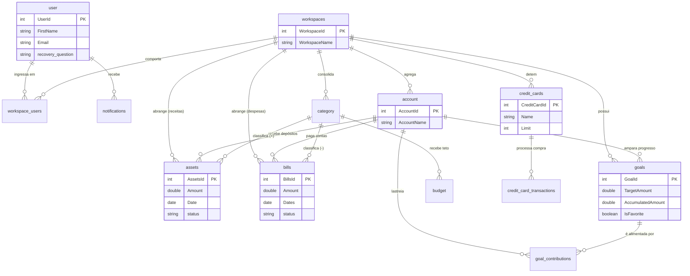

# 🚀 Gerenciador Financeiro Pessoal (SaaS Multi-Tenant)

> Um ecossistema de elite para gestão financeira, projetado para o controle absoluto do seu patrimônio, seja ele individual ou compartilhado via visões colaborativas.

---

## 📌 A Nova Era do Controle Financeiro
O sistema transcende o simples rastreamento de gastos. Ele é construído sobre uma base de **Soberania de Dados** e **Arquitetura Industrial (Clean Arch)**, unindo a agilidade do **Vue.js 3** com a robustez e segurança de uma API **PHP 8.4 (Slim Framework)**.

O coração do projeto é o **Cockpit Financeiro**, uma engine inteligente que sintetiza seu fluxo de caixa, investimentos e metas em uma visão 360º unificada por Workspaces. O sistema conta ainda com um **Módulo de Conciliação Bancária (BETA)** robusto, capaz de processar PDF, CSV e OFX com aprendizado contínuo de layouts.

---

## 🏗️ Arquitetura do Projeto

### 🖥️ Arquitetura Frontend
Construído com foco em fluidez de estado e tipagem, o frontend utiliza o padrão **Clean Architecture**, isolando as lógicas de negócio dos componentes visuais.
*   **Core / Engine**: Vue 3 (Composition API) orquestrado pelo Vite, entregando Hot-Module-Replacement quase instantâneo na fase de desenvolvimento.
*   **Data & API Layer**: `axios` configurado como HTTP Client (no `HttpClient.ts`) que atua através de Interceptors injetando o JWT (Token) e identificador do Workspace atual (`X-Workspace-Id`) em absolutamente cada requisição. O roteamento de erros também é unificado nesta camada, escrevendo falhas globais direto no Console do DevTools para monitoria constante.
*   **Presentation / UI**: Formulada em **Tailwind CSS**, abraçando um modelo `Mobile-First` responsivo total. Padrões de Micro-animações enriquecem as transições de Dashboard e navegações entre os Workspaces; renderização de gráficos complexos a cargo do **ApexCharts**.

### ⚙️ Arquitetura Backend
O Backend é uma API RESTful de alta resposta orientada a Injeção de Dependências.
*   **Server & Router**: PHP 8.4 impulsionando o microframework **Slim 4**. A API abraça um ecossistema estrito através de "RouteCollectorProxy", centralizando checagens de autorização.
*   **Fluxo de Requisitos (Pattern)**: O fluxo obedece à tríade de Separação de Preocupações (`Controllers` -> `Services` -> `Repositories`).
    *   **Controllers** blindam a borda, validando parâmetros HTTP.
    *   **Services** comportam todas as regras financeiras complexas (Ex: Recalcular `projectedBalance` no Dashboard).
    *   **Repositories** executam a persistência isolando a conexão PDO, permitindo facilmente a adoção de mockups nos Testes.
*   **Gatekeepers / Segurança**: Middlewares (`AuthMiddleware`, `WorkspaceMiddleware`) filtram acessos baseados na força do Token JWT.
*   **Migrations**: A estrutura evolutiva do banco está sob custódia oficial do **Phinx**, garantindo integridade das mutações do DB da Produção sem perigo de quebra (Idempotência nativa aplicada nas últimas versões).

---

## 🗄️ Estrutura do Banco de Dados (DER)

Este projeto opera um ecossistema SQL baseamente desenhado num modelo estrela focado na entidade **Workspace** (`SaaS / Multi-Tenant`). Isso garante que dados Pessoais sejam física e logicamente separados de dados Famliares/Conta Conjunta, bastando apenas uma troca de contexto na sessão.

### 📝 Dicionário de Tabelas (O que cada uma faz?)
1.  **`user`**: Detém as chaves da vida do cliente (Autenticação via senha e Perguntas de Recuperação de segurança isoladas).
2.  **`workspaces`**: Núcleo isolador do SaaS. Representa uma "bolha financeira" autônoma (Pode ser do tipo *Pessoal*, *Empresa*, *Casal*). Em volta dele transitam quase todos os registros.
3.  **`workspace_users`**: Tabela pivô de Relação que define *quem* pode entrar nos Workspaces e com *qual poder* (`owner`, `editor`, `viewer`).
4.  **`account` / `bank_accounts`**: Suas caixas-fortes. Contas Correntes, Carteira Pessoal, Contas Digitais dentro de um determinado Workspace.
5.  **`category`**: Classificador universal termométrico da saúde financeira (Alimentação, Lazer, etc).
6.  **`assets`**: Representa todas as **Receitas / Entradas** de fluxo financeiro vinculadas ou não a categorias e contas (Também usado em investimentos).
7.  **`bills`**: Representa todas as **Despesas / Saídas** de fluxo de caixa (incluindo status dinâmico entre Pendente ou Paga).
8.  **`budget`**: O Limitador termométrico. Atribui teto de gastos (`amount`) estrito a categorias num dado mês.
9.  **`credit_cards`**: Entidade matriz para abstrair cartões plásticos de faturas fechadas (Dias de Fechamento/Vencimento e Limite de Crédito).
10. **`credit_card_transactions`**: Compras efetuadas no crédito, segmentadas por cartões, podendo calcular recursivamente projeções de *parcelamentos* em faturas virtuais através dos anos.
11. **`goals`**: Suas Metas de Vida. Uma poupança paralela travada ("Comprar Carro", "Viagem Europa") com `TargetAmount` (Alvo) a ser alcançado e vinculação possível à sua conta corrente preferida.
12. **`goal_contributions`**: "Pingos d'água" de investimentos mensais e discretos sendo alocados contra a Tabela `goals` para avanço quantificado de progresso.
13. **`notifications`**: Ponto central de alarme multi-serviços assíncrono.
14. **`totals`**: Um snapshot computado local que mantém o saldo cacheado da conta para aliviar agregações imensas e leituras do Cockpit.
15. **`bank_statement_templates`**: Cérebro da engine de importação. Armazena padrões de Regex e mapeamentos de colunas aprendidos pela IA para automatizar a leitura de extratos de novos bancos.

### 📊 Diagrama Entidade-Relacionamento (Mermaid ERD)

---

## 🚀 Pipeline Automatizada de Deploy (CI/CD)
O ecossistema é mantido vivo de forma automática através das `GitHub Actions`:
*   **Workflow Staging (Sandbox)**: Gatilho automático ou manual focado na porta SSH, espelha para o provedor Hostinger e reergue o container Sandbox (`porta 8082`), rodando também a injeção do `PHPMyAdmin (8083)` para debug manual interno.
*   **Workflow Produção**: Uma rotina controlada manualmente que refaz o espelhamento mas de forma sólida isolando para o tráfego da rede (`porta 80` padrão).
*   **CI (`verify.yml`)**: PHPUnit (com cobertura), Vitest e build do frontend.
*   **Security & Quality Gate (`security.yml`)**: SAST (Semgrep OWASP Top 10 + CodeQL), SCA (`composer audit`, `npm audit`, OWASP Dependency-Check semanal), Gitleaks, DAST (OWASP ZAP contra a app em Docker) e SonarCloud opcional, consolidados no job **Quality Gate**.

> Revisão completa, pendências e roadmap: [`docs/REVISAO_E_ROADMAP.md`](docs/REVISAO_E_ROADMAP.md).
> **Deploy:** defina `JWT_SECRET` (mín. 32 caracteres) no `.env` antes de subir staging/produção.

---

## 💻 Instalação Local (Developer Setup)

**Requisitos**: Docker, NodeJS v20+

1.  **Infraestrutura**: `docker compose up -d` (MySQL/MariaDB).
2.  **Banco de Dados**: `vendor/bin/phinx migrate -e development`.
3.  **API**: `php -S 0.0.0.0:8000 -t public/`.
4.  **Frontend**: `cd frontend && npm install && npm run dev`.

Acesse em: `http://localhost:5173`

---

*Desenvolvido com foco em precisão matemática e design de alta fidelidade. MIT License.*
